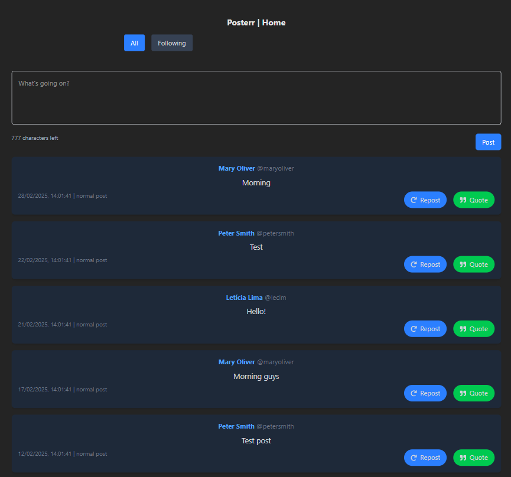
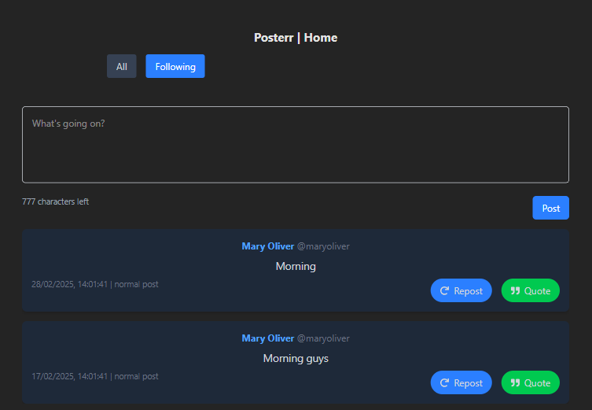
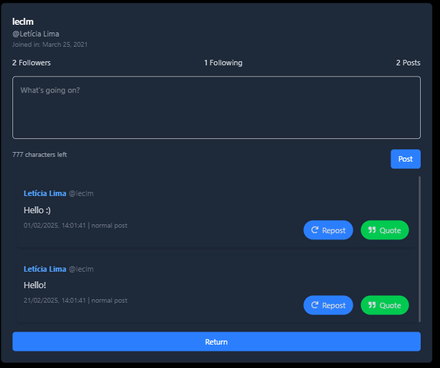
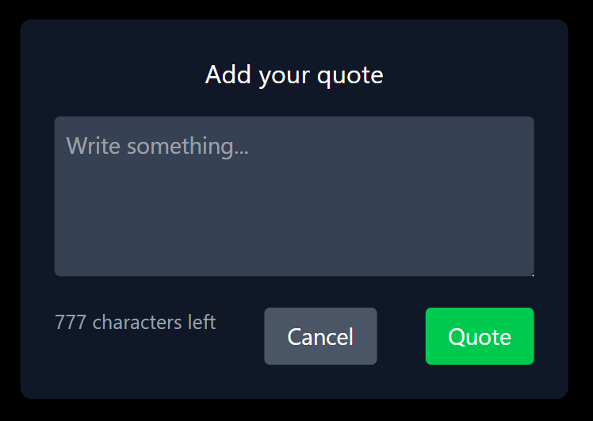
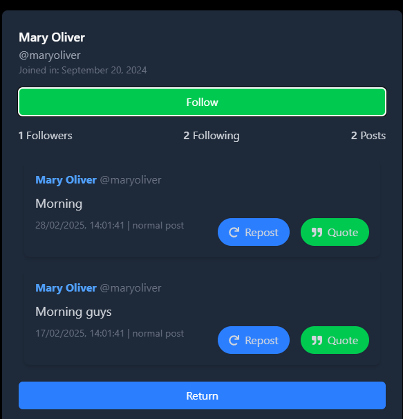
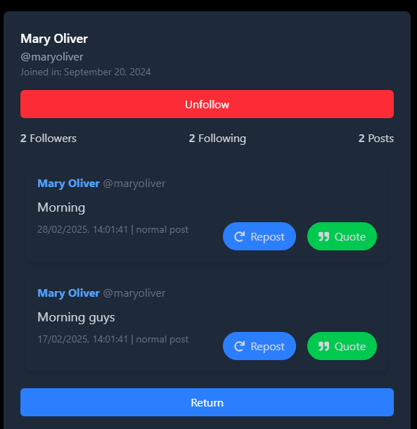

# Letícia das Chagas Lima
#
# 📢 Posterr

Posterr is a minimalist social media platform inspired by Twitter. Users can create posts, quote other posts, and repost content while adhering to daily posting limits.

## 🚀 Features

- 📝 **Create Posts**: Users can publish original posts with a character limit.
- 🔁 **Repost & Quote**: Repost other users' content or add a comment with a quote.
- 📃 **User Profiles**: View a user's profile and their post history.
- 🏠 **Home Feed**: Displays all posts with filters for "All" and "Following".
- 📜 **Infinite Scroll**: Posts load dynamically as the user scrolls.
- 📌 **Daily Post Limits**: Users can only create up to 5 posts per day.
- 🌙 **Dark Theme**: A sleek, modern dark-mode UI.

## 🛠️ Tech Stack

- **Frontend**: React (Vite), TypeScript, Tailwind
- **State Management**: React hooks and local storage
- **Routing**: React Router
- **Data Handling**: Local storage-based mock data

## 📂 Project Structure

```
posterr/
│-- src/
│   │-- components/       # Reusable UI components
│   │-- pages/            # Page components (Home, Profile, etc.)
│   │-- routes/           # Application routes
│   │-- utils/            # Utility functions and mock data
│   │-- types/            # TypeScript types
│   │-- App.tsx           # Main application component
│-- public/               # Static assets
│-- package.json          # Project metadata and dependencies
│-- README.md             # Project documentation
```


---

## 📸 Screenshots

| Home Feed | Filter | Profile |
|-----------|-------------|-------------|
|  |  |  | 

| Quote Modal | Follow | Unfollow |
|-------------|-------------|-------------|
|  |  |  |

---

## 🎯 Installation & Setup

1. Clone the repository or just open the folder on your machine:
   ```sh
   git clone https://github.com/leclm/posterr.git
   cd posterr
   ```

2. Install dependencies:
   ```sh
   npm install
   ```

3. Start the development server:
   ```sh
   npm run dev
   ```

4. Open [http://localhost:5173](http://localhost:5173) in your browser.


## Planning

### Questions for the Product Manager

1. Should users be able to reply to any post, including reposts and quote posts?
2. Can users reply multiple times to the same post?
3. Should replies count toward the 5-post daily limit?
4. Should replies be threaded (nested) or just listed chronologically?
5. Should we limit the number of replies shown in the "Posts and Replies" tab at once?

### Implementation Plan

#### Database / Local Storage Changes

- Introduce a new **post type**: `reply`.
- Replies will reference the `id` of the post they are replying to.
- The `userId` will indicate which user posted the reply.
- Update the `mock` storage structure to store replies separately or within the same posts array with a new type distinction.

#### Frontend Changes

- **Post Component:** Update the component to display `@mentions` at the start of reply posts.
- **Profile Page:** Add a new tab **"Posts and Replies"** to display both normal posts and replies.
- **Reply Form:** Allow users to reply to a post, pre-filling the `@mention` of the original poster.
- **Reply Button:** Add a new reply button to each post.

#### API Changes (if applicable in a real backend scenario)

- Add a new endpoint: `GET /users/:id/replies` to fetch replies.
- Modify `POST /posts` to accept `replyTo` field indicating the original post ID.

### Assumptions

- Replies are treated like regular posts but categorized separately.
- Replies do not appear in the home feed.
- No deep threading—replies are displayed in a flat list.
- Replies count towards the daily limit of 5 posts.


## Critique

### Improvements

If given more time, the following improvements would be made:

- **Enhanced UI/UX**: Improve styling and usability, especially for post interactions.
- **Better State Management**: Implement Redux or Context API for cleaner and more scalable state handling.
- **Testing**: Add unit and integration tests using Jest and React Testing Library.
- **Optimized Performance**: Improve how posts are fetched and displayed to minimize re-renders and optimize local storage interactions.

### Scaling Considerations

As the platform grows, here are potential failure points and scaling strategies:

1. **Performance Bottlenecks**: Storing all posts in local storage would be unsustainable. A real database with indexed queries would be needed.
2. **Backend Infrastructure**:
   - Migrate from local storage to a cloud-based database (PostgreSQL, Firebase, or MongoDB).
   - Implement caching with Redis for frequently accessed data.
   - Use a serverless architecture or containerized backend with Kubernetes for better scalability.
3. **API Rate Limits & Optimization**:
   - Implement GraphQL or optimized RESTful endpoints.
4. **Authentication & Security**:
   - Add user authentication with OAuth or JWT.

By addressing these issues, Posterr could efficiently scale to support thousands or even millions of users.
